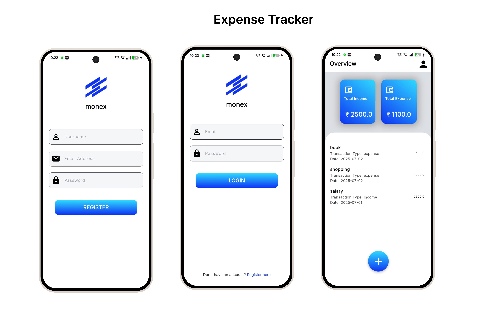
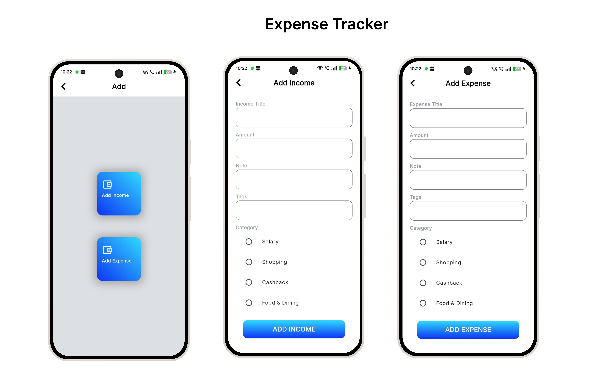

# 💰 Expense Tracker

 

A personal finance management app to track income and expenses. Built with **Flutter** frontend and a **Django** backend.

## 📱 Features
- Add, edit, and delete transactions
- Track monthly expenses by category
- Persistent backend with Django
- Clean UI and responsive design

## 🛠 Tech Stack
- **Frontend**: Flutter
- **Backend**: Django (REST API)
- **State Management**: Provider
- **HTTP Client**: Dio
